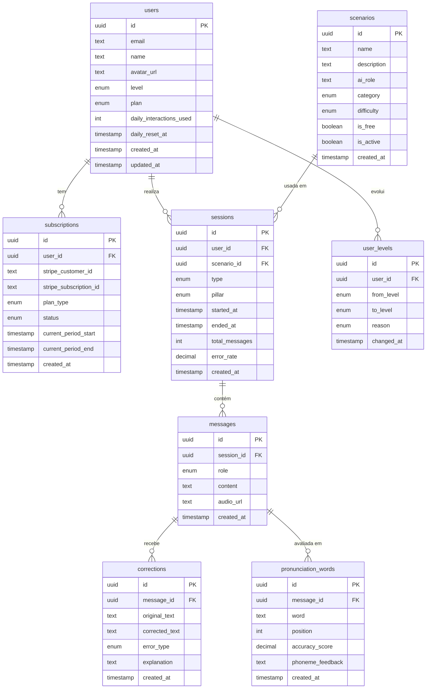

# Modelo de Dados

> **Versão:** 1.0.0 | **Data:** 2026-03-21 | **Status:** ✅ Aprovado

Banco de dados: **PostgreSQL via Supabase**.
A autenticação é gerenciada pelo Supabase Auth — a tabela `users` é um perfil que estende `auth.users`.

---

## Diagrama ER

---

## Tabelas

### `users`

Perfil do usuário. Estende `auth.users` do Supabase.

| Coluna | Tipo | Obrigatório | Descrição |
|---|---|---|---|
| `id` | `uuid` | ✅ | FK para `auth.users.id` |
| `email` | `text` | ✅ | E-mail do usuário |
| `name` | `text` | ✅ | Nome de exibição |
| `avatar_url` | `text` | — | URL da foto de perfil |
| `level` | `enum(A2, B1, B2)` | ✅ | Nível atual de inglês |
| `plan` | `enum(free, pro)` | ✅ | Plano atual, default `free` |
| `daily_interactions_used` | `int` | ✅ | Interações usadas hoje, default `0` |
| `daily_reset_at` | `timestamp` | ✅ | Quando o contador foi zerado pela última vez |
| `created_at` | `timestamp` | ✅ | Data de cadastro |
| `updated_at` | `timestamp` | ✅ | Última atualização do perfil |

---

### `subscriptions`

Assinatura Pro via Stripe. Um usuário pode ter no máximo uma assinatura ativa.

| Coluna | Tipo | Obrigatório | Descrição |
|---|---|---|---|
| `id` | `uuid` | ✅ | PK |
| `user_id` | `uuid` | ✅ | FK → `users.id` |
| `stripe_customer_id` | `text` | ✅ | ID do cliente no Stripe |
| `stripe_subscription_id` | `text` | ✅ | ID da assinatura no Stripe |
| `plan_type` | `enum(monthly, annual)` | ✅ | Tipo do plano |
| `status` | `enum(active, canceled, past_due, trialing)` | ✅ | Status atual |
| `current_period_start` | `timestamp` | ✅ | Início do período atual |
| `current_period_end` | `timestamp` | ✅ | Fim do período atual (data de renovação) |
| `created_at` | `timestamp` | ✅ | Data da primeira assinatura |

---

### `scenarios`

Cenários de roleplay disponíveis na plataforma.

| Coluna | Tipo | Obrigatório | Descrição |
|---|---|---|---|
| `id` | `uuid` | ✅ | PK |
| `name` | `text` | ✅ | Nome do cenário (ex: "Check-in em hotel") |
| `description` | `text` | ✅ | Descrição exibida ao usuário |
| `ai_role` | `text` | ✅ | Papel que a IA assume (ex: "Hotel receptionist") |
| `category` | `enum(work, travel, daily)` | ✅ | Categoria do cenário |
| `difficulty` | `enum(A2, B1, B2)` | ✅ | Nível de dificuldade |
| `is_free` | `boolean` | ✅ | Disponível no plano Free, default `false` |
| `is_active` | `boolean` | ✅ | Visível para os usuários, default `true` |
| `created_at` | `timestamp` | ✅ | Data de criação |

**Dados iniciais (seed):**

| name | category | difficulty | is_free |
|---|---|---|---|
| Check-in em hotel | travel | B1 | true |
| Daily standup em inglês | work | B1 | true |
| Small talk casual | daily | A2 | false |

---

### `sessions`

Cada sessão de conversa iniciada pelo usuário.

| Coluna | Tipo | Obrigatório | Descrição |
|---|---|---|---|
| `id` | `uuid` | ✅ | PK |
| `user_id` | `uuid` | ✅ | FK → `users.id` |
| `scenario_id` | `uuid` | — | FK → `scenarios.id` (null se conversa livre) |
| `type` | `enum(free_chat, roleplay)` | ✅ | Tipo de sessão |
| `pillar` | `enum(writing, speaking, comprehension)` | ✅ | Pilar praticado na sessão |
| `started_at` | `timestamp` | ✅ | Início da sessão |
| `ended_at` | `timestamp` | — | Fim da sessão (null se em andamento) |
| `total_messages` | `int` | ✅ | Total de mensagens do usuário, default `0` |
| `error_rate` | `decimal(5,2)` | — | % de mensagens com erros (calculado ao encerrar) |
| `created_at` | `timestamp` | ✅ | Data de criação |

---

### `messages`

Mensagens individuais de uma sessão (usuário e IA).

| Coluna | Tipo | Obrigatório | Descrição |
|---|---|---|---|
| `id` | `uuid` | ✅ | PK |
| `session_id` | `uuid` | ✅ | FK → `sessions.id` |
| `role` | `enum(user, assistant)` | ✅ | Quem enviou a mensagem |
| `content` | `text` | ✅ | Conteúdo em texto (transcrição se for voz) |
| `audio_url` | `text` | — | URL no Supabase Storage (voz do usuário ou TTS da IA) |
| `created_at` | `timestamp` | ✅ | Data/hora da mensagem |

---

### `corrections`

Correções gramaticais e de vocabulário geradas pela IA para mensagens do usuário.

| Coluna | Tipo | Obrigatório | Descrição |
|---|---|---|---|
| `id` | `uuid` | ✅ | PK |
| `message_id` | `uuid` | ✅ | FK → `messages.id` |
| `original_text` | `text` | ✅ | Trecho original com erro |
| `corrected_text` | `text` | ✅ | Versão correta sugerida |
| `error_type` | `enum(grammar, vocabulary, pronunciation)` | ✅ | Tipo do erro |
| `explanation` | `text` | ✅ | Explicação didática do erro |
| `created_at` | `timestamp` | ✅ | Data de criação |

---

### `pronunciation_words`

Score de pronúncia por palavra, retornado pelo Azure Speech.

| Coluna | Tipo | Obrigatório | Descrição |
|---|---|---|---|
| `id` | `uuid` | ✅ | PK |
| `message_id` | `uuid` | ✅ | FK → `messages.id` (mensagem de voz do usuário) |
| `word` | `text` | ✅ | Palavra avaliada |
| `position` | `int` | ✅ | Posição na frase (ordem) |
| `accuracy_score` | `decimal(5,2)` | ✅ | Score de 0 a 100 |
| `phoneme_feedback` | `text` | — | Feedback fonético quando score < 70 |
| `created_at` | `timestamp` | ✅ | Data de criação |

---

### `user_levels`

Histórico de evolução de nível do usuário.

| Coluna | Tipo | Obrigatório | Descrição |
|---|---|---|---|
| `id` | `uuid` | ✅ | PK |
| `user_id` | `uuid` | ✅ | FK → `users.id` |
| `from_level` | `enum(A2, B1, B2)` | ✅ | Nível anterior |
| `to_level` | `enum(A2, B1, B2)` | ✅ | Novo nível |
| `reason` | `enum(auto, manual)` | ✅ | Origem da mudança |
| `changed_at` | `timestamp` | ✅ | Data da mudança |

---

## Regras de Negócio no Banco

| Regra | Implementação |
|---|---|
| Limite diário Free (10 interações) | `daily_interactions_used` + `daily_reset_at` em `users`; checado no backend a cada requisição |
| Reset diário do contador | Backend verifica se `daily_reset_at` < hoje e zera `daily_interactions_used` |
| Plano do usuário | Campo `plan` em `users` atualizado via webhook do Stripe |
| Histórico de nível | Toda mudança em `users.level` gera um registro em `user_levels` via trigger |
| error_rate da sessão | Calculado e salvo em `sessions.error_rate` ao encerrar a sessão |

---

## Índices

| Tabela | Coluna(s) | Motivo |
|---|---|---|
| `sessions` | `user_id, started_at DESC` | Listar histórico do usuário ordenado por data |
| `messages` | `session_id, created_at ASC` | Carregar conversa em ordem cronológica |
| `corrections` | `message_id` | Buscar correções de uma mensagem |
| `pronunciation_words` | `message_id, position ASC` | Buscar palavras de uma mensagem em ordem |
| `user_levels` | `user_id, changed_at DESC` | Histórico de evolução do usuário |
