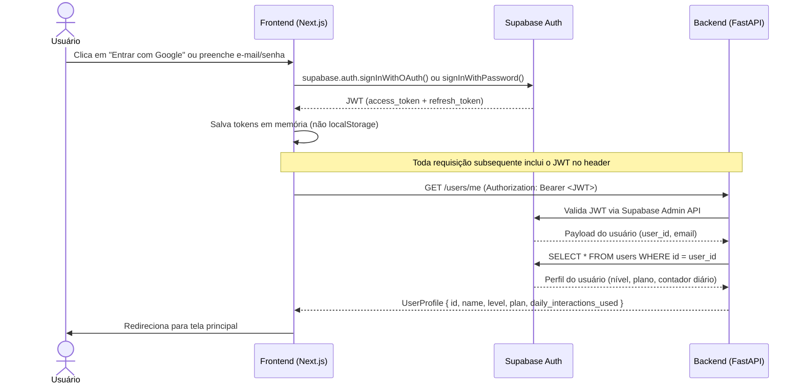
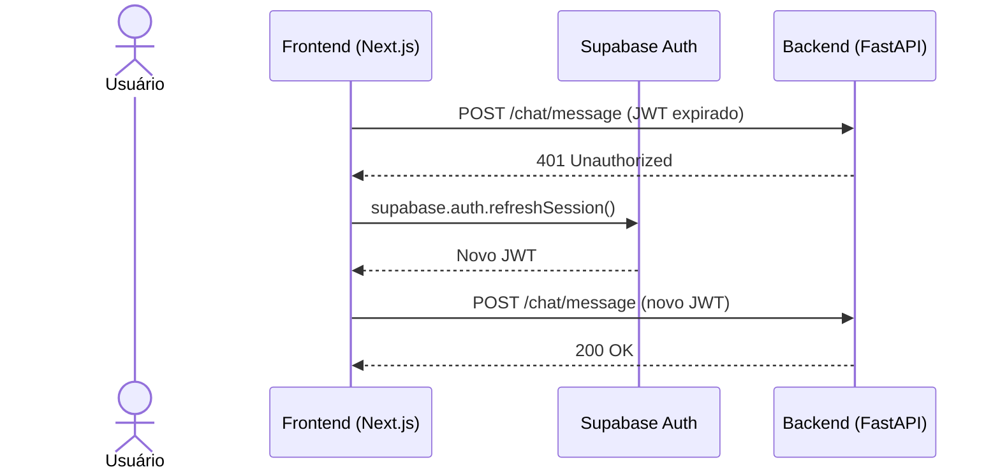
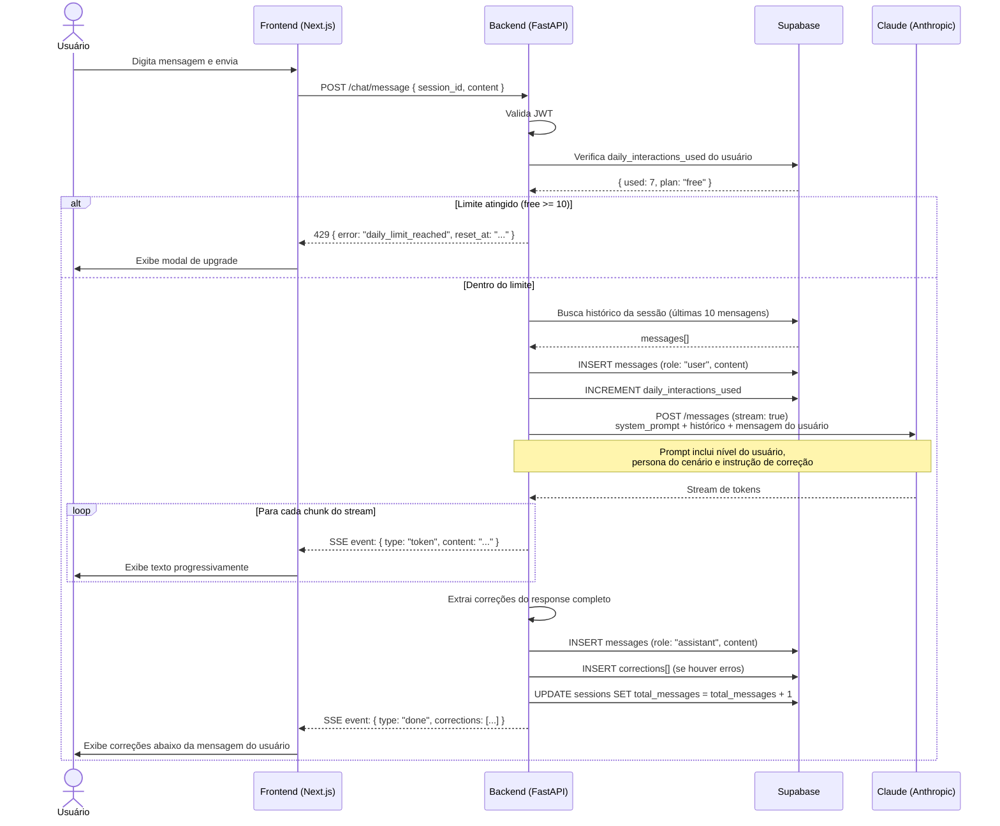
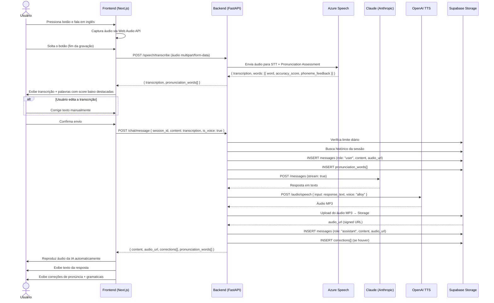
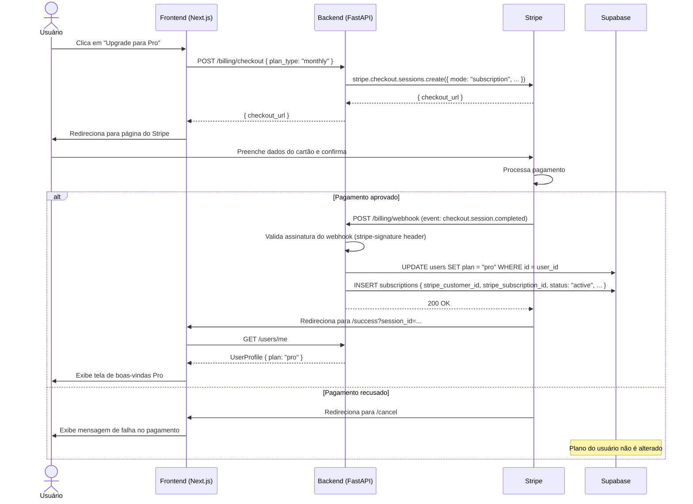
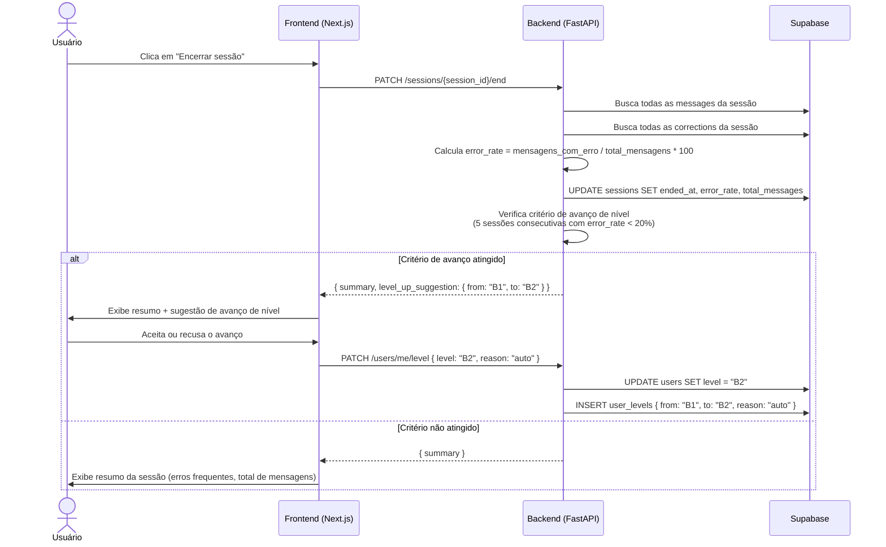
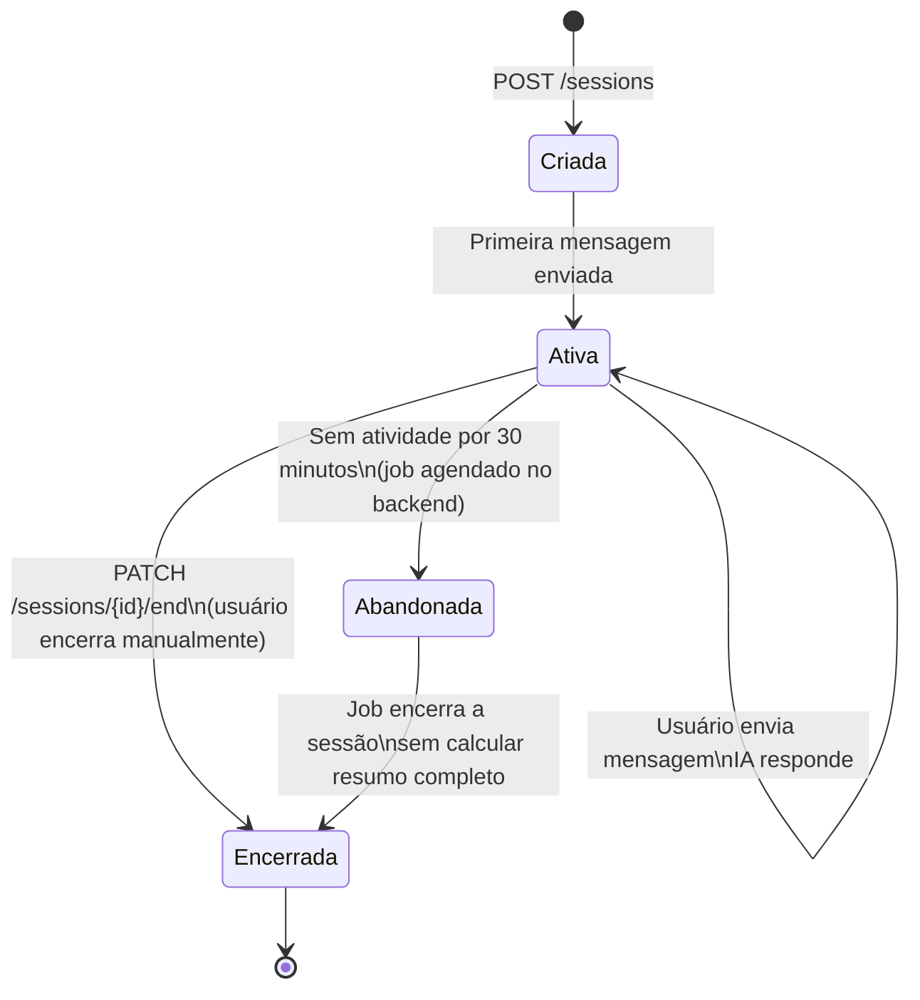

# Software Design Document (SDD)

> **Versão:** 1.0.0 | **Data:** 2026-03-21 | **Status:** ✅ Aprovado

---

## 1. Diagramas de Sequência

### 1.1 — Autenticação

Fluxo de login com e-mail/senha ou Google OAuth. A autenticação acontece diretamente entre o Frontend e o Supabase Auth — o Backend apenas valida o JWT nas requisições subsequentes.



**Fluxo de erro — token expirado:**



---

### 1.2 — Conversa por Texto

A resposta da Claude é transmitida em **streaming via SSE (Server-Sent Events)** para o frontend exibir o texto conforme vai sendo gerado, sem esperar a resposta completa.



---

### 1.3 — Conversa por Voz

O fluxo de voz é o mais complexo — envolve 4 serviços externos em sequência. O usuário vê a transcrição antes de confirmar o envio, permitindo correção de erros de transcrição.



---

### 1.4 — Upgrade para Plano Pro (Stripe)

O pagamento ocorre na página hospedada pelo Stripe (Checkout). O Backend é notificado via webhook — nunca pelo frontend diretamente.



---

### 1.5 — Encerramento de Sessão



---

## 2. Contratos de API

Base URL: `https://api.fluentloop.com.br/v1`

Todas as rotas (exceto `/billing/webhook`) exigem header:
```
Authorization: Bearer <supabase_jwt>
```

---

### Usuários

#### `GET /users/me`
Retorna o perfil do usuário autenticado.

**Response 200:**
```json
{
  "id": "uuid",
  "email": "user@email.com",
  "name": "Lucas Mendes",
  "avatar_url": "https://...",
  "level": "B1",
  "plan": "free",
  "daily_interactions_used": 7,
  "daily_reset_at": "2026-03-21T03:00:00Z"
}
```

#### `PATCH /users/me`
Atualiza nome ou avatar do usuário.

**Request:**
```json
{ "name": "Lucas M.", "avatar_url": "https://..." }
```

#### `PATCH /users/me/level`
Atualiza o nível do usuário (manual ou confirmação de avanço automático).

**Request:**
```json
{ "level": "B2", "reason": "manual" }
```

---

### Sessões

#### `POST /sessions`
Inicia uma nova sessão.

**Request:**
```json
{
  "type": "roleplay",
  "pillar": "speaking",
  "scenario_id": "uuid"
}
```

**Response 201:**
```json
{
  "id": "uuid",
  "type": "roleplay",
  "pillar": "speaking",
  "scenario": { "id": "uuid", "name": "Check-in em hotel", "ai_role": "Hotel receptionist" },
  "started_at": "2026-03-21T20:00:00Z"
}
```

#### `GET /sessions`
Lista sessões do usuário (paginado).

**Query params:** `page`, `limit`, `type`

**Response 200:**
```json
{
  "data": [
    {
      "id": "uuid",
      "type": "roleplay",
      "pillar": "speaking",
      "scenario_name": "Check-in em hotel",
      "started_at": "...",
      "ended_at": "...",
      "total_messages": 12,
      "error_rate": 16.7
    }
  ],
  "total": 24,
  "page": 1
}
```

#### `GET /sessions/{id}`
Retorna detalhes completos de uma sessão (transcript + correções).

**Response 200:**
```json
{
  "id": "uuid",
  "messages": [
    {
      "id": "uuid",
      "role": "user",
      "content": "I want to check in, please.",
      "audio_url": null,
      "corrections": [
        {
          "original_text": "I want to check in",
          "corrected_text": "I'd like to check in",
          "error_type": "vocabulary",
          "explanation": "'I'd like' is more polite and natural in formal contexts."
        }
      ],
      "created_at": "..."
    }
  ],
  "summary": {
    "total_messages": 12,
    "error_rate": 16.7,
    "most_common_error_type": "grammar"
  }
}
```

#### `PATCH /sessions/{id}/end`
Encerra uma sessão e calcula o resumo.

**Response 200:**
```json
{
  "summary": {
    "total_messages": 12,
    "error_rate": 16.7,
    "duration_seconds": 480
  },
  "level_up_suggestion": {
    "from": "B1",
    "to": "B2"
  }
}
```

---

### Chat

#### `POST /chat/message`
Envia mensagem e recebe resposta da IA em streaming (SSE).

**Request:**
```json
{
  "session_id": "uuid",
  "content": "I want to check in, please.",
  "is_voice": false
}
```

**Response:** `text/event-stream`
```
data: {"type": "token", "content": "Sure"}
data: {"type": "token", "content": "! Let"}
data: {"type": "token", "content": " me help you."}
data: {"type": "done", "corrections": [...], "message_id": "uuid"}
```

---

### Voz

#### `POST /speech/transcribe`
Transcreve áudio e retorna avaliação de pronúncia.

**Request:** `multipart/form-data`
- `audio`: arquivo de áudio (WAV ou WebM)
- `session_id`: uuid

**Response 200:**
```json
{
  "transcription": "I want to check in please",
  "pronunciation_words": [
    { "word": "I", "position": 0, "accuracy_score": 98, "phoneme_feedback": null },
    { "word": "check", "position": 3, "accuracy_score": 62, "phoneme_feedback": "The 'ch' sound should be /tʃ/, not /ʃ/." }
  ]
}
```

#### `POST /speech/tts`
Gera áudio para um texto (usado internamente após resposta da IA).

**Request:**
```json
{ "text": "Sure! Let me help you.", "message_id": "uuid" }
```

**Response 200:**
```json
{ "audio_url": "https://supabase.storage.../audio/uuid.mp3" }
```

---

### Cenários

#### `GET /scenarios`
Lista cenários disponíveis para o plano do usuário.

**Response 200:**
```json
{
  "data": [
    {
      "id": "uuid",
      "name": "Check-in em hotel",
      "description": "Pratique um check-in em um hotel internacional.",
      "ai_role": "Hotel receptionist",
      "category": "travel",
      "difficulty": "B1",
      "is_free": true
    }
  ]
}
```

---

### Pagamentos

#### `POST /billing/checkout`
Cria sessão de checkout no Stripe.

**Request:**
```json
{ "plan_type": "monthly" }
```

**Response 200:**
```json
{ "checkout_url": "https://checkout.stripe.com/..." }
```

#### `POST /billing/webhook`
Recebe eventos do Stripe. **Não requer JWT** — autenticação via `stripe-signature` header.

Eventos tratados:
- `checkout.session.completed` → ativa plano Pro
- `customer.subscription.deleted` → reverte para Free
- `invoice.payment_failed` → marca `past_due`

#### `GET /billing/subscription`
Retorna dados da assinatura ativa.

**Response 200:**
```json
{
  "plan_type": "monthly",
  "status": "active",
  "current_period_end": "2026-04-21T00:00:00Z",
  "stripe_customer_portal_url": "https://billing.stripe.com/..."
}
```

---

## 3. Tratamento de Erros

### Códigos de status

| Código | Situação |
|---|---|
| `400` | Request inválido (campos faltando, tipo errado) |
| `401` | JWT ausente, inválido ou expirado |
| `403` | Recurso não permitido para o plano do usuário |
| `404` | Recurso não encontrado |
| `429` | Limite diário atingido |
| `503` | Serviço externo indisponível (Claude, Azure, OpenAI) |

### Formato padrão de erro

```json
{
  "error": "daily_limit_reached",
  "message": "Você atingiu o limite de 10 interações diárias do plano Free.",
  "details": {
    "limit": 10,
    "used": 10,
    "reset_at": "2026-03-22T03:00:00Z",
    "upgrade_url": "/pricing"
  }
}
```

### Estratégia por serviço externo

| Serviço | Falha | Comportamento |
|---|---|---|
| **Claude** | Timeout ou 5xx | Retorna `503`, frontend exibe "Tente novamente". Não salva a mensagem. |
| **Azure Speech** | Falha na transcrição | Retorna `503`, frontend oferece fallback para digitação manual |
| **Azure Speech** | Baixa confiança na transcrição | Retorna transcrição com flag `low_confidence: true`, frontend avisa o usuário |
| **OpenAI TTS** | Falha na geração de áudio | Retorna resposta em texto normalmente, sem áudio (`audio_url: null`) |
| **Stripe webhook** | Falha no processamento | Retorna `500`, Stripe retenta automaticamente por até 3 dias |
| **Supabase** | Falha na escrita | Retorna `503`, nenhuma cobrança de interação é feita |

---

## 4. Ciclo de Vida da Sessão



**Estados:**

| Estado | Descrição | `ended_at` | `error_rate` |
|---|---|---|---|
| `Criada` | Sessão iniciada, aguardando primeira mensagem | `null` | `null` |
| `Ativa` | Conversa em andamento | `null` | `null` |
| `Encerrada` | Finalizada pelo usuário com resumo calculado | preenchido | calculado |
| `Abandonada` | Encerrada por inatividade, sem resumo completo | preenchido | `null` |

---

## 5. Segurança

| Ponto | Implementação |
|---|---|
| Autenticação | JWT gerado pelo Supabase, validado no Backend em toda requisição |
| Webhook Stripe | Validado via `stripe-signature` header — rejeita qualquer request sem assinatura válida |
| Rate limiting | Middleware no FastAPI: 60 req/min por IP para rotas públicas; limite de interações por usuário no banco |
| Inputs do usuário | Sanitização no Backend antes de enviar ao Claude (prevenção de prompt injection) |
| Áudios no Storage | URLs assinadas com expiração de 1 hora — sem acesso público permanente |
| Chaves de API | Variáveis de ambiente no Railway/Vercel — nunca expostas no frontend |
