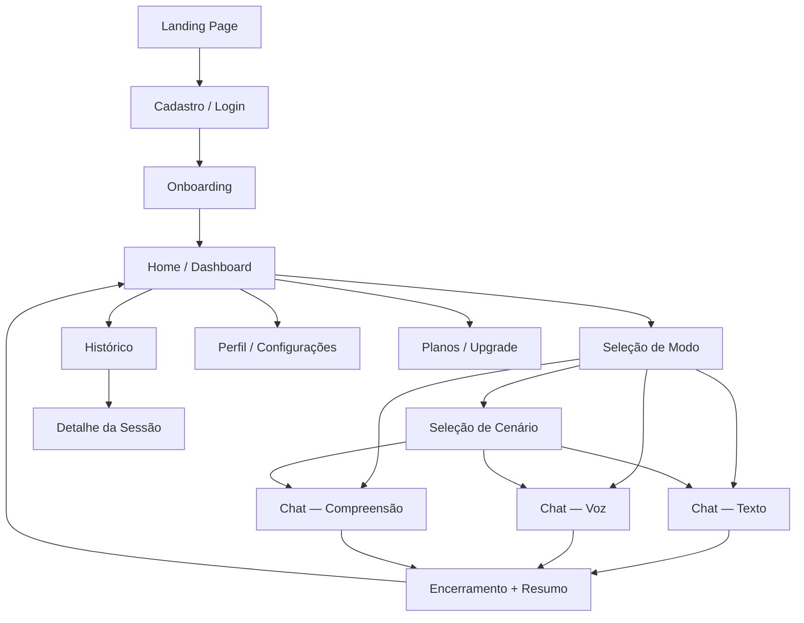

# Wireframes

> **Versão:** 1.0.0 | **Data:** 2026-03-21 | **Status:** ✅ Aprovado

Wireframes de baixa fidelidade para todas as telas do MVP.
Notação: `[Botão]` = botão, `[_____]` = input, `████` = imagem/mídia, `▶` = ação de play.

---

## Fluxo de Navegação



---

## 1. Landing Page

```
┌──────────────────────────────────────────────────────────────┐
│  FluentLoop                          [Entrar]  [Começar grátis] │
├──────────────────────────────────────────────────────────────┤
│                                                              │
│         Pare de travar. Comece a falar inglês.              │
│                                                              │
│    Pratique conversação real com IA — texto, voz e          │
│    compreensão — no seu ritmo, sem julgamentos.             │
│                                                              │
│              [ Começar grátis — é rápido ]                  │
│                                                              │
│         ✍️ Escrita   🎙️ Fala   👂 Compreensão               │
│                                                              │
├──────────────────────────────────────────────────────────────┤
│                                                              │
│  Como funciona                                               │
│                                                              │
│  ┌────────────────┐  ┌────────────────┐  ┌───────────────┐  │
│  │  1. Escolha    │  │  2. Converse   │  │  3. Evolua    │  │
│  │  um cenário    │  │  por texto     │  │  com feedback │  │
│  │  ou converse   │  │  ou voz com    │  │  em tempo     │  │
│  │  livremente    │  │  a IA          │  │  real         │  │
│  └────────────────┘  └────────────────┘  └───────────────┘  │
│                                                              │
├──────────────────────────────────────────────────────────────┤
│                                                              │
│  Planos                                                      │
│                                                              │
│  ┌──────────────────────┐    ┌──────────────────────────┐   │
│  │  Free                │    │  Pro  ★ Recomendado       │   │
│  │  Grátis              │    │  R$29,90/mês              │   │
│  │                      │    │                           │   │
│  │  ✓ 10 interações/dia │    │  ✓ Ilimitado              │   │
│  │  ✓ 2 cenários        │    │  ✓ Todos os cenários      │   │
│  │  ✓ Texto + Voz       │    │  ✓ Texto + Voz + Dashboard│   │
│  │                      │    │                           │   │
│  │  [ Começar grátis ]  │    │  [ Assinar Pro ]          │   │
│  └──────────────────────┘    └──────────────────────────┘   │
│                                                              │
└──────────────────────────────────────────────────────────────┘
```

---

## 2. Cadastro / Login

```
┌──────────────────────────────────────────────────┐
│                  FluentLoop                       │
├──────────────────────────────────────────────────┤
│                                                   │
│         Crie sua conta gratuita                  │
│                                                   │
│   [ G  Continuar com Google               ]      │
│                                                   │
│   ──────────── ou ────────────                   │
│                                                   │
│   Nome completo                                   │
│   [________________________________________]      │
│                                                   │
│   E-mail                                          │
│   [________________________________________]      │
│                                                   │
│   Senha                                           │
│   [________________________________________]      │
│                                                   │
│   [ Criar conta ]                                │
│                                                   │
│   Já tem conta? [Entrar]                         │
│                                                   │
│   Ao criar uma conta você concorda com os        │
│   [Termos de uso] e a [Política de privacidade]  │
│                                                   │
└──────────────────────────────────────────────────┘
```

**Tela de Login:**
```
┌──────────────────────────────────────────────────┐
│                  FluentLoop                       │
├──────────────────────────────────────────────────┤
│                                                   │
│              Bem-vindo de volta                  │
│                                                   │
│   [ G  Entrar com Google                  ]      │
│                                                   │
│   ──────────── ou ────────────                   │
│                                                   │
│   E-mail                                          │
│   [________________________________________]      │
│                                                   │
│   Senha                                           │
│   [________________________________________]      │
│                                                   │
│   [Esqueci minha senha]                          │
│                                                   │
│   [ Entrar ]                                     │
│                                                   │
│   Não tem conta? [Criar conta grátis]            │
│                                                   │
└──────────────────────────────────────────────────┘
```

---

## 3. Onboarding

```
┌──────────────────────────────────────────────────┐
│  FluentLoop                          Passo 1 de 2 │
├──────────────────────────────────────────────────┤
│                                                   │
│     Olá, Lucas! Qual é o seu nível de inglês?   │
│                                                   │
│     Isso ajuda a IA a adaptar as conversas       │
│     ao seu ritmo.                                 │
│                                                   │
│  ┌────────────────────────────────────────────┐  │
│  │  ○  A2 — Iniciante-intermediário           │  │
│  │     Entendo frases simples, mas trava       │  │
│  │     em conversas mais longas.               │  │
│  └────────────────────────────────────────────┘  │
│                                                   │
│  ┌────────────────────────────────────────────┐  │
│  │  ●  B1 — Intermediário  ← Mais comum       │  │
│  │     Me comunico, mas trava quando preciso   │  │
│  │     falar de forma espontânea.              │  │
│  └────────────────────────────────────────────┘  │
│                                                   │
│  ┌────────────────────────────────────────────┐  │
│  │  ○  B2 — Intermediário-avançado            │  │
│  │     Converso bem, mas quero fluência        │  │
│  │     e vocabulário mais rico.                │  │
│  └────────────────────────────────────────────┘  │
│                                                   │
│                          [ Continuar → ]          │
│                                                   │
└──────────────────────────────────────────────────┘
```

```
┌──────────────────────────────────────────────────┐
│  FluentLoop                          Passo 2 de 2 │
├──────────────────────────────────────────────────┤
│                                                   │
│     O que você mais quer praticar?               │
│                                                   │
│  ┌──────────────┐  ┌──────────────┐              │
│  │  ☑ Trabalho  │  │  ☑ Viagens   │              │
│  │  Reuniões,   │  │  Hotel,      │              │
│  │  apresent.   │  │  aeroporto   │              │
│  └──────────────┘  └──────────────┘              │
│                                                   │
│  ┌──────────────┐  ┌──────────────┐              │
│  │  ☐ Dia a dia │  │  ☐ Tudo      │              │
│  │  Small talk, │  │  Quero       │              │
│  │  hobbies     │  │  variedade   │              │
│  └──────────────┘  └──────────────┘              │
│                                                   │
│  [ ← Voltar ]              [ Começar a praticar ]│
│                                                   │
└──────────────────────────────────────────────────┘
```

---

## 4. Home / Dashboard

```
┌──────────────────────────────────────────────────────────────┐
│  FluentLoop         [🔔]  [Lucas ▾]                          │
├──────────────────────────────────────────────────────────────┤
│                                                              │
│  Bom dia, Lucas! 👋                                          │
│  Você está no nível B1.  [Ver progresso]                    │
│                                                              │
│  ┌──────────────┐  ┌──────────────┐  ┌──────────────────┐  │
│  │  Hoje        │  │  Esta semana │  │  Total           │  │
│  │  7 / 10      │  │  3 sessões   │  │  Level: B1       │  │
│  │  interações  │  │  realizadas  │  │  ↑ desde A2      │  │
│  └──────────────┘  └──────────────┘  └──────────────────┘  │
│                                                              │
├──────────────────────────────────────────────────────────────┤
│                                                              │
│  Praticar agora                                              │
│                                                              │
│  ┌────────────────────────┐  ┌────────────────────────────┐ │
│  │  💬 Conversa livre     │  │  🎭 Roleplay               │ │
│  │                        │  │                            │ │
│  │  Fale sobre qualquer   │  │  Escolha um cenário e      │ │
│  │  assunto com a IA      │  │  pratique situações reais  │ │
│  │                        │  │                            │ │
│  │  [ Começar ]           │  │  [ Ver cenários ]          │ │
│  └────────────────────────┘  └────────────────────────────┘ │
│                                                              │
├──────────────────────────────────────────────────────────────┤
│                                                              │
│  Últimas sessões                               [Ver todas]  │
│                                                              │
│  ┌──────────────────────────────────────────────────────┐   │
│  │  🎭 Check-in em hotel · Voz · 12 min · 16% erros    │   │
│  │  Ontem, 21h30                               [Ver]   │   │
│  └──────────────────────────────────────────────────────┘   │
│  ┌──────────────────────────────────────────────────────┐   │
│  │  💬 Conversa livre · Texto · 8 min · 22% erros      │   │
│  │  Seg, 19h45                                 [Ver]   │   │
│  └──────────────────────────────────────────────────────┘   │
│                                                              │
├──────────────────────────────────────────────────────────────┤
│  🏠 Home   📋 Histórico   👤 Perfil                          │
└──────────────────────────────────────────────────────────────┘
```

---

## 5. Seleção de Cenário (Roleplay)

```
┌──────────────────────────────────────────────────────────────┐
│  ← Voltar          Escolha um cenário                        │
├──────────────────────────────────────────────────────────────┤
│                                                              │
│  [✈️ Viagens]  [🏢 Trabalho]  [☕ Dia a dia]  [Todos]       │
│                                                              │
│  ┌──────────────────────────────────────────────────────┐   │
│  │  ✈️  Check-in em hotel                    FREE       │   │
│  │  Dificuldade: B1  ·  Papel da IA: Recepcionista      │   │
│  │  Pratique fazer o check-in em um hotel internacional  │   │
│  │                                                       │   │
│  │  Modo:  [✍️ Texto]  [🎙️ Voz]  [👂 Compreensão]      │   │
│  │                                      [ Iniciar ]     │   │
│  └──────────────────────────────────────────────────────┘   │
│                                                              │
│  ┌──────────────────────────────────────────────────────┐   │
│  │  🏢  Daily standup em inglês              FREE       │   │
│  │  Dificuldade: B1  ·  Papel da IA: Colega / Facilitador│  │
│  │  Simule um daily standup com seu time internacional   │   │
│  │                                                       │   │
│  │  Modo:  [✍️ Texto]  [🎙️ Voz]  [👂 Compreensão]      │   │
│  │                                      [ Iniciar ]     │   │
│  └──────────────────────────────────────────────────────┘   │
│                                                              │
│  ┌──────────────────────────────────────────────────────┐   │
│  │  ☕  Small talk casual                    🔒 PRO     │   │
│  │  Dificuldade: A2  ·  Papel da IA: Amigo nativo       │   │
│  │  Bata um papo informal sobre hobbies e dia a dia      │   │
│  │                                                       │   │
│  │                               [ Assinar Pro para usar]│   │
│  └──────────────────────────────────────────────────────┘   │
│                                                              │
└──────────────────────────────────────────────────────────────┘
```

---

## 6. Sessão de Chat — Modo Texto

```
┌──────────────────────────────────────────────────────────────┐
│  ← Encerrar    🎭 Check-in em hotel    [🎙️ Voz] [👂 Áudio]  │
│  Papel da IA: Hotel Receptionist              7/10 hoje  🔴  │
├──────────────────────────────────────────────────────────────┤
│                                                              │
│                                                              │
│  ┌──────────────────────────────────────────────────────┐   │
│  │  🤖  Good afternoon! Welcome to the Grand Hotel.     │   │
│  │      How can I help you today?              14:02    │   │
│  └──────────────────────────────────────────────────────┘   │
│                                                              │
│         ┌────────────────────────────────────────────────┐  │
│         │  I want to make a check in, please.   14:03  │  │
│         └────────────────────────────────────────────────┘  │
│  ┌─────────────────────────────────┐                        │
│  │  ✏️ Sugestão de melhoria:       │                        │
│  │  "I want to make a check in"   │                        │
│  │  → "I'd like to check in"      │                        │
│  │  💡 'I'd like' soa mais natural │                        │
│  │     e educado em contextos      │                        │
│  │     formais.           [Entendi]│                        │
│  └─────────────────────────────────┘                        │
│                                                              │
│  ┌──────────────────────────────────────────────────────┐   │
│  │  🤖  Of course! Could I have your name and           │   │
│  │      reservation number, please?            14:03    │   │
│  └──────────────────────────────────────────────────────┘   │
│                                                              │
│         ┌────────────────────────────────────────────────┐  │
│         │  Sure! My name is Lucas and my reservation... │  │
│         │  ✍️ digitando...                               │  │
│         └────────────────────────────────────────────────┘  │
│                                                              │
├──────────────────────────────────────────────────────────────┤
│                                                              │
│  [_________________________________] [🎙️] [Enviar →]        │
│                                                              │
└──────────────────────────────────────────────────────────────┘
```

**Legenda:**
- `🔴` = limite próximo (free plan)
- `[🎙️ Voz]` = alterna para modo voz
- `[👂 Áudio]` = alterna para modo compreensão

---

## 7. Sessão de Chat — Modo Voz

```
┌──────────────────────────────────────────────────────────────┐
│  ← Encerrar    🎭 Check-in em hotel   [✍️ Texto] [👂 Áudio]  │
│  Papel da IA: Hotel Receptionist              7/10 hoje  🔴  │
├──────────────────────────────────────────────────────────────┤
│                                                              │
│  ┌──────────────────────────────────────────────────────┐   │
│  │  🤖  Of course! Could I have your name and           │   │
│  │      reservation number, please?            14:03    │   │
│  └──────────────────────────────────────────────────────┘   │
│                                                              │
│                                                              │
│              ┌─────────────────────────┐                    │
│              │                         │                    │
│              │   🎙️  Gravando...       │                    │
│              │                         │                    │
│              │   ▁▃▅▇▅▃▁▂▄▆▄▂▁        │                    │
│              │   (visualização de voz) │                    │
│              │                         │                    │
│              │      00:04              │                    │
│              │                         │                    │
│              │   [  ⏹ Parar  ]         │                    │
│              └─────────────────────────┘                    │
│                                                              │
│                                                              │
│       Pressione e segure para falar                         │
│                                                              │
│              [ 🎙️  Segurar para falar ]                     │
│                                                              │
└──────────────────────────────────────────────────────────────┘
```

**Após soltar o botão — confirmação da transcrição:**

```
┌──────────────────────────────────────────────────────────────┐
│  ← Encerrar    🎭 Check-in em hotel   [✍️ Texto] [👂 Áudio]  │
├──────────────────────────────────────────────────────────────┤
│                                                              │
│  ┌──────────────────────────────────────────────────────┐   │
│  │  Você disse:                                          │   │
│  │                                                       │   │
│  │  "Sure! My name is Lucas and my reservation          │   │
│  │   number is five five tree two."                      │   │
│  │                                                       │   │
│  │  Pronúncia:                                          │   │
│  │  Sure ✅  My ✅  name ✅  is ✅  Lucas ✅            │   │
│  │  reservation ✅  number ✅  is ✅                    │   │
│  │  five ✅  five ✅  🔴 tree → three  two ✅           │   │
│  │                                                       │   │
│  │  [_____________________________________] Editar      │   │
│  │                                                       │   │
│  │              [ Cancelar ]  [ Enviar → ]               │   │
│  └──────────────────────────────────────────────────────┘   │
│                                                              │
└──────────────────────────────────────────────────────────────┘
```

---

## 8. Sessão de Chat — Modo Compreensão

```
┌──────────────────────────────────────────────────────────────┐
│  ← Encerrar    🎭 Check-in em hotel  [✍️ Texto] [🎙️ Voz]    │
│  Papel da IA: Hotel Receptionist                             │
├──────────────────────────────────────────────────────────────┤
│                                                              │
│  A IA vai falar. Ouça com atenção e responda.               │
│                                                              │
│  ┌──────────────────────────────────────────────────────┐   │
│  │  🤖  ████████████████████████████                    │   │
│  │                                                       │   │
│  │   ▶ ──────────────●────────────── 0:04 / 0:07       │   │
│  │                                                       │   │
│  │   Velocidade:  [🐢 Lento]  [Normal ●]  [🐇 Rápido]  │   │
│  │                                                       │   │
│  │   [🔁 Ouvir novamente]                               │   │
│  └──────────────────────────────────────────────────────┘   │
│                                                              │
│  ┌──────────────────────────────────────────────────────┐   │
│  │  📝 O que você entendeu? Digite abaixo:              │   │
│  │                                                       │   │
│  │  [__________________________________________________] │   │
│  │                                                       │   │
│  │  Dica: Não precisa ser palavra por palavra —          │   │
│  │  capture o sentido da frase.                         │   │
│  │                                                       │   │
│  │                              [ Confirmar → ]         │   │
│  └──────────────────────────────────────────────────────┘   │
│                                                              │
│  ─────────── Resultado da última resposta ───────────       │
│                                                              │
│  ✅ Você entendeu: "Could I have your name and..."          │
│  💡 Palavra que você perdeu: "reservation number"           │
│                                                              │
└──────────────────────────────────────────────────────────────┘
```

---

## 9. Encerramento de Sessão + Resumo

```
┌──────────────────────────────────────────────────────────────┐
│                    Sessão encerrada! 🎉                       │
├──────────────────────────────────────────────────────────────┤
│                                                              │
│  🎭 Check-in em hotel  ·  Modo: Voz  ·  Duração: 12 min    │
│                                                              │
│  ┌────────────┐  ┌────────────┐  ┌────────────────────────┐ │
│  │  Mensagens │  │  Taxa de   │  │  Pronúncia             │ │
│  │     18     │  │   erros    │  │  Média: 84pts          │ │
│  │            │  │    16%     │  │                        │ │
│  └────────────┘  └────────────┘  └────────────────────────┘ │
│                                                              │
├──────────────────────────────────────────────────────────────┤
│                                                              │
│  Erros mais frequentes nesta sessão                         │
│                                                              │
│  ┌──────────────────────────────────────────────────────┐   │
│  │  ✏️ Vocabulário · 3x                                 │   │
│  │  "I want to" → "I'd like to"                         │   │
│  │  Mais formal e natural em contextos de serviço.      │   │
│  └──────────────────────────────────────────────────────┘   │
│                                                              │
│  ┌──────────────────────────────────────────────────────┐   │
│  │  🔴 Pronúncia · "three" pronunciado como "tree"      │   │
│  │  O som /θ/ (th) é diferente do /t/ simples.          │   │
│  └──────────────────────────────────────────────────────┘   │
│                                                              │
├──────────────────────────────────────────────────────────────┤
│                                                              │
│  🏆 Você está no caminho certo!                              │
│  4 de 5 sessões com taxa de erro abaixo de 20%              │
│  Mais 1 sessão assim e você avança para B2!                 │
│                                                              │
├──────────────────────────────────────────────────────────────┤
│                                                              │
│  [ Praticar novamente ]        [ Voltar para o início ]     │
│                                                              │
└──────────────────────────────────────────────────────────────┘
```

**Variante — Sugestão de avanço de nível:**

```
┌──────────────────────────────────────────────────────────────┐
│                                                              │
│  🎓 Parabéns! Você está pronto para o B2                    │
│                                                              │
│  Você completou 5 sessões consecutivas com menos            │
│  de 20% de erros. Quer avançar para o nível B2?            │
│                                                              │
│  B1 → B2: A IA vai usar vocabulário mais rico,             │
│  expressões idiomáticas e ritmo mais natural.               │
│                                                              │
│  [ Não agora, continuar no B1 ]  [ ✅ Avançar para B2 ]    │
│                                                              │
└──────────────────────────────────────────────────────────────┘
```

---

## 10. Histórico de Sessões

```
┌──────────────────────────────────────────────────────────────┐
│  ← Voltar           Histórico                                │
├──────────────────────────────────────────────────────────────┤
│                                                              │
│  [Todas ●]  [Texto]  [Voz]  [Compreensão]                   │
│                                                              │
│  Março 2026                                                  │
│                                                              │
│  ┌──────────────────────────────────────────────────────┐   │
│  │  🎭 Check-in em hotel                                │   │
│  │  🎙️ Voz  ·  12 min  ·  18 msgs  ·  16% erros        │   │
│  │  Hoje, 14h03                                [Ver →]  │   │
│  └──────────────────────────────────────────────────────┘   │
│                                                              │
│  ┌──────────────────────────────────────────────────────┐   │
│  │  💬 Conversa livre                                   │   │
│  │  ✍️ Texto  ·  8 min  ·  12 msgs  ·  22% erros        │   │
│  │  Ontem, 19h45                               [Ver →]  │   │
│  └──────────────────────────────────────────────────────┘   │
│                                                              │
│  ┌──────────────────────────────────────────────────────┐   │
│  │  🎭 Daily standup                                    │   │
│  │  👂 Compreensão  ·  15 min  ·  10 msgs  ·  10% erros │   │
│  │  19/03, 20h12                               [Ver →]  │   │
│  └──────────────────────────────────────────────────────┘   │
│                                                              │
│  ┌──────────────────────────────────────────────────────┐   │
│  │  💬 Conversa livre                                   │   │
│  │  🎙️ Voz  ·  6 min  ·  9 msgs  ·  33% erros          │   │
│  │  18/03, 21h00                               [Ver →]  │   │
│  └──────────────────────────────────────────────────────┘   │
│                                                              │
├──────────────────────────────────────────────────────────────┤
│  🏠 Home   📋 Histórico ●   👤 Perfil                        │
└──────────────────────────────────────────────────────────────┘
```

---

## 11. Detalhe de Sessão (Transcript)

```
┌──────────────────────────────────────────────────────────────┐
│  ← Histórico   🎭 Check-in em hotel · 21/03 · 14h03         │
├──────────────────────────────────────────────────────────────┤
│                                                              │
│  ┌────────────┐  ┌────────────┐  ┌────────────────────────┐ │
│  │  12 min    │  │  18 msgs   │  │  16% erros             │ │
│  └────────────┘  └────────────┘  └────────────────────────┘ │
│                                                              │
│  [Transcript ●]  [Erros da sessão]                          │
│                                                              │
│  ┌──────────────────────────────────────────────────────┐   │
│  │  🤖  Good afternoon! Welcome to the Grand Hotel.     │   │
│  │      How can I help you today?              14:02    │   │
│  └──────────────────────────────────────────────────────┘   │
│                                                              │
│       ┌────────────────────────────────────────────────┐    │
│       │ I want to make a check in, please.    14:03  │    │
│       └────────────────────────────────────────────────┘    │
│  ┌──────────────────────────────────────────────────────┐   │
│  │  ✏️ "I want to" → "I'd like to"                      │   │
│  │  Mais formal e natural em contextos de atendimento.  │   │
│  └──────────────────────────────────────────────────────┘   │
│                                                              │
│  ┌──────────────────────────────────────────────────────┐   │
│  │  🤖  Of course! Could I have your name and           │   │
│  │      reservation number, please?            14:03    │   │
│  └──────────────────────────────────────────────────────┘   │
│                                                              │
│            ········ continua ········                        │
│                                                              │
│                          [ 🗑️ Deletar sessão ]              │
│                                                              │
└──────────────────────────────────────────────────────────────┘
```

---

## 12. Perfil e Configurações

```
┌──────────────────────────────────────────────────────────────┐
│  ← Voltar                Perfil                              │
├──────────────────────────────────────────────────────────────┤
│                                                              │
│            ┌──────┐                                         │
│            │  👤  │  Lucas Mendes                           │
│            └──────┘  gosilva.pro@gmail.com                  │
│                       [Editar perfil]                        │
│                                                              │
├──────────────────────────────────────────────────────────────┤
│                                                              │
│  Nível de inglês                                             │
│  B1 — Intermediário                    [Ajustar manualmente] │
│                                                              │
│  Plano atual                                                 │
│  Free  ·  7/10 interações hoje         [ Upgrade para Pro ] │
│                                                              │
├──────────────────────────────────────────────────────────────┤
│                                                              │
│  Preferências                                                │
│                                                              │
│  Sotaque da IA                                               │
│  ( ● ) Americano    (   ) Britânico                         │
│                                                              │
│  Mostrar correções automaticamente                          │
│  [  ● ON  ]                                                  │
│                                                              │
│  Idioma da interface                                         │
│  ( ● ) Português    (   ) English                           │
│                                                              │
├──────────────────────────────────────────────────────────────┤
│                                                              │
│  [Política de privacidade]    [Exportar meus dados]         │
│                                                              │
│  [ Sair da conta ]                                          │
│                                                              │
│  [ 🗑️ Excluir minha conta ]                                 │
│                                                              │
└──────────────────────────────────────────────────────────────┘
```

---

## 13. Página de Planos / Upgrade

```
┌──────────────────────────────────────────────────────────────┐
│  ← Voltar              Escolha seu plano                     │
├──────────────────────────────────────────────────────────────┤
│                                                              │
│         Desbloqueie o inglês que você precisa               │
│                                                              │
│  ┌─────────────────────────┐  ┌───────────────────────────┐ │
│  │  Free                   │  │  Pro              ★        │ │
│  │  Grátis                 │  │  [Mensal ●] [Anual -30%]  │ │
│  │                         │  │  R$29,90/mês              │ │
│  │  ✓ 10 interações/dia   │  │                           │ │
│  │  ✓ 2 cenários          │  │  ✓ Interações ilimitadas  │ │
│  │  ✓ Texto + Voz         │  │  ✓ Todos os cenários      │ │
│  │  ✗ Histórico completo  │  │  ✓ Histórico completo     │ │
│  │  ✗ Dashboard           │  │  ✓ Dashboard de progresso │ │
│  │                         │  │  ✓ Texto + Voz + Áudio   │ │
│  │                         │  │                           │ │
│  │  Plano atual            │  │  [ Assinar Pro ]          │ │
│  └─────────────────────────┘  └───────────────────────────┘ │
│                                                              │
│  ✓ Cancele quando quiser   ✓ Sem fidelidade                 │
│  ✓ Pagamento seguro via Stripe                              │
│                                                              │
├──────────────────────────────────────────────────────────────┤
│                                                              │
│  Dúvidas frequentes                                         │
│                                                              │
│  ▾ Posso cancelar a qualquer momento?                       │
│    Sim. O acesso Pro permanece até o fim do período pago.   │
│                                                              │
│  ▾ O plano Free tem limite de tempo?                        │
│    Não. O Free é para sempre, com as limitações descritas.  │
│                                                              │
└──────────────────────────────────────────────────────────────┘
```

---

## 14. Modal — Limite Diário Atingido (Free)

```
┌──────────────────────────────────────────────────┐
│                                                   │
│  ⏰ Limite diário atingido                        │
│                                                   │
│  Você usou suas 10 interações de hoje.           │
│  O limite reseta à meia-noite.                   │
│                                                   │
│  Quer praticar sem limites?                      │
│                                                   │
│  ┌───────────────────────────────────────────┐   │
│  │  Pro · R$29,90/mês                        │   │
│  │  ✓ Interações ilimitadas                  │   │
│  │  ✓ Todos os cenários                      │   │
│  │  ✓ Dashboard de progresso                 │   │
│  └───────────────────────────────────────────┘   │
│                                                   │
│  [ Assinar Pro ]                                 │
│                                                   │
│  [Voltar e aguardar até meia-noite]              │
│                                                   │
└──────────────────────────────────────────────────┘
```
